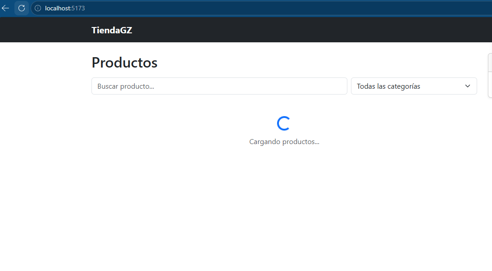
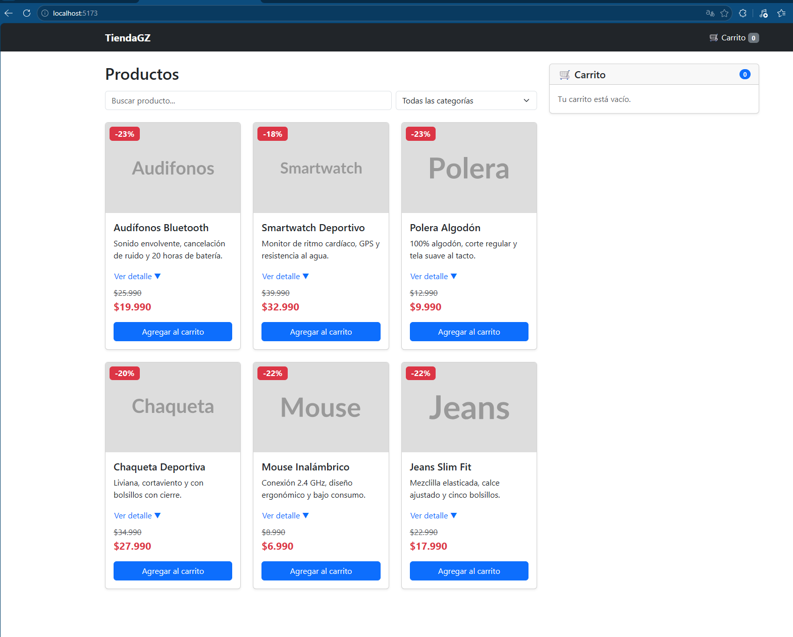
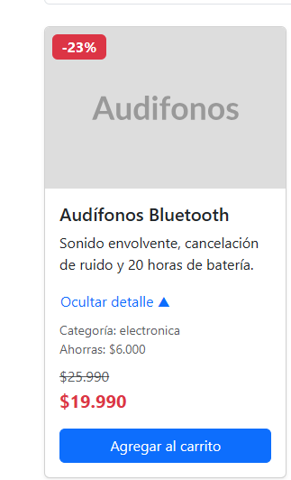
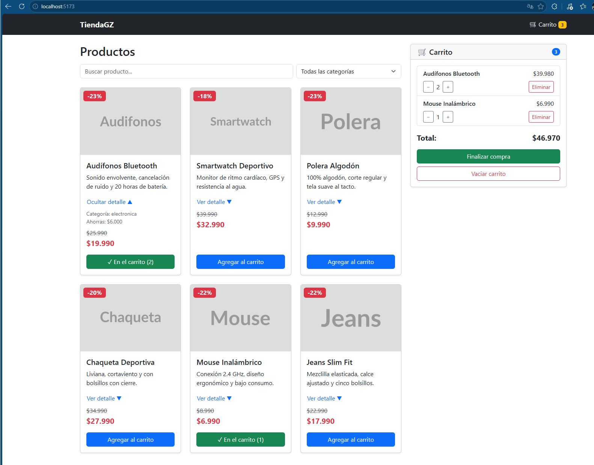
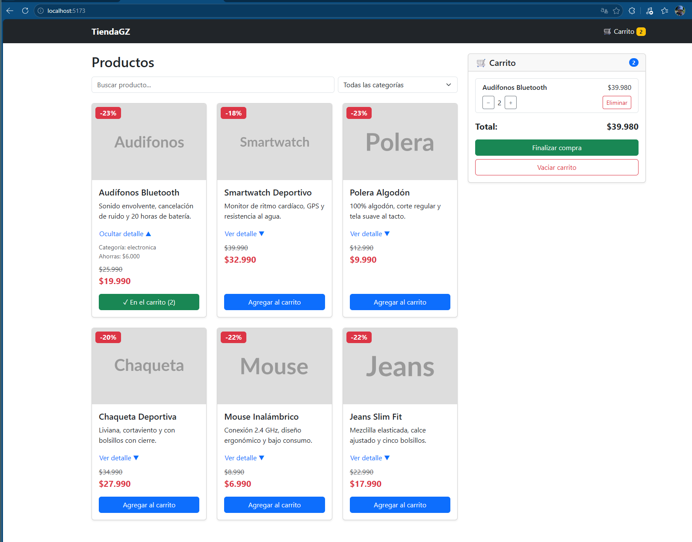
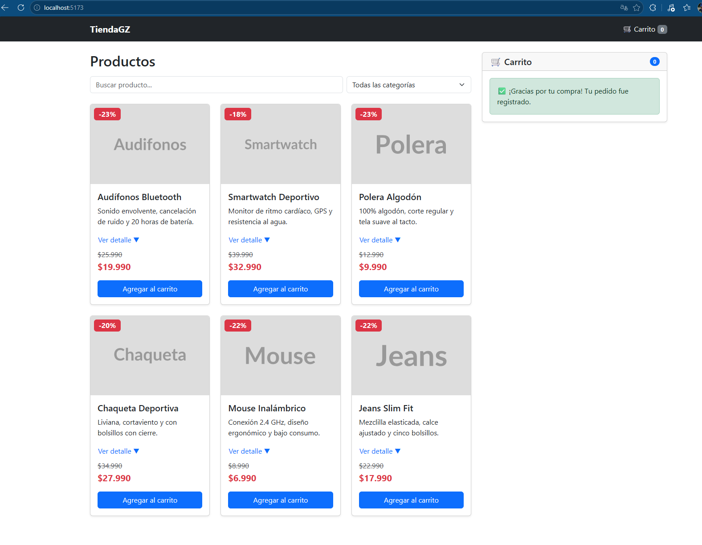
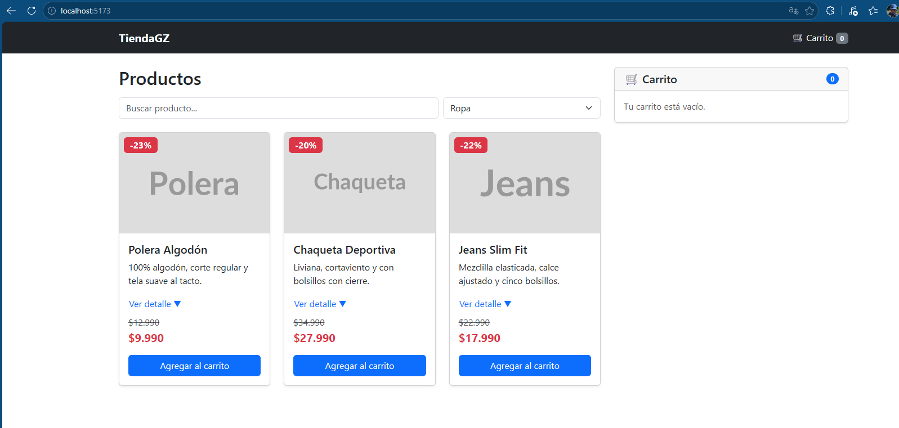
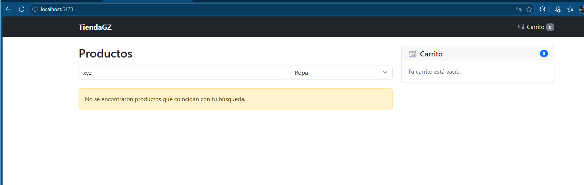
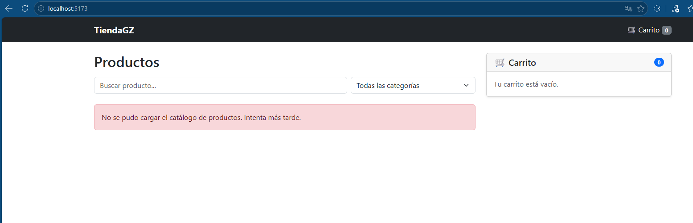

# 🛒 TiendaGZ — eCommerce con React + Vite

Proyecto del curso **Desarrollo Frontend I (PFY2201)** — Duoc UC.
**Evaluación Sumativa Semana 8:** *Mejorando funcionalidades clave en el eCommerce con React.*

🔗 **Sitio publicado (gh-pages):** https://felipeca365.github.io/tiendagz-react/
📁 **Repositorio:** https://github.com/Felipeca365/tiendagz-react

---

## 📌 Descripción

TiendaGZ es la evolución del eCommerce desarrollado durante el curso:

| Etapa | Tecnología | Repositorio |
|---|---|---|
| Semanas 4–6 | HTML + Bootstrap + JavaScript (DOM, Fetch API) | [ecommerce-semana6](https://github.com/Felipeca365/ecommerce-semana6) |
| Semanas 7–8 | **React + Vite** (componentes, props, hooks) | Este repositorio |

La aplicación se reconstruyó con **componentes funcionales**, **props**, los hooks **`useState`** y **`useEffect`**, y **renderizado condicional**, manteniendo el diseño con **Bootstrap 5**.

---

## ✅ Funcionalidades

### Catálogo
- Carga dinámica de productos desde un archivo JSON local (`fetch` dentro de `useEffect`).
- Carga simulada de 0,8 s con **spinner** para representar la demora de un servidor real.
- Cada producto muestra: **nombre, precio normal, precio oferta, descripción e imagen**.
- **Badge de descuento** calculado automáticamente.
- Botón **"Ver detalle ▼ / Ocultar detalle ▲"** con estado propio en cada tarjeta.
- **Buscador** por nombre (ignora mayúsculas y tildes) y **filtro por categoría**.

### Carrito de compras
- Agregar productos (si ya existe, aumenta la cantidad).
- Sumar / restar unidades y eliminar productos.
- **Contador** de productos en la barra superior y en el carrito.
- **Total** a pagar en pesos chilenos.
- **Vaciar carrito** y **Finalizar compra**.

### Renderizado condicional

| Situación | Resultado en pantalla |
|---|---|
| Datos cargando | Spinner + "Cargando productos..." |
| Error al cargar el JSON | Alerta roja con mensaje amigable |
| Búsqueda sin coincidencias | Aviso amarillo "No se encontraron productos" |
| Carrito vacío | "Tu carrito está vacío." |
| Compra finalizada | "✅ ¡Gracias por tu compra!" |
| Producto ya agregado | Botón cambia de **azul "Agregar al carrito"** a **verde "✓ En el carrito (N)"** |
| Carrito con productos / vacío | Badge del navbar **amarillo** / **gris** |
| Producto con descuento | Badge rojo con el porcentaje |

---

## 🎯 Cumplimiento de la pauta de evaluación

| Criterio | Implementación | Archivo |
|---|---|---|
| **1. Gestión de estados con `useState`** | Estados para catálogo (`productos`), carrito (`carrito`), carga, error, búsqueda, categoría y compra realizada. Estado local `mostrarDetalle` en cada tarjeta (botón que cambia de texto). | `App.jsx`, `ProductCard.jsx` |
| **2. Efectos con `useEffect`** | Carga del catálogo desde `public/data/productos.json` al montar el componente, con manejo de errores y función de limpieza (`clearTimeout`). | `App.jsx` |
| **3. Renderizado condicional** | Mensajes (`&&`), vistas alternativas (operador ternario) y estilos dinámicos (clases según el estado). Ver tabla anterior. | `App.jsx`, `Carrito.jsx`, `ProductCard.jsx`, `Navbar.jsx` |
| **4. Buenas prácticas** | Carpetas `components/` y `utils/`, componentes con una sola responsabilidad, funciones reutilizables (`formatearPrecio`, `normalizarTexto`) para evitar duplicación, comentarios en todo el código y revisión con ESLint sin errores. | Todo `src/` |
| **5. GitHub + gh-pages** | Repositorio público y despliegue con el paquete `gh-pages` (rama `gh-pages`), con `base` configurado en Vite. | `vite.config.js`, `package.json` |

---

## 🧱 Estructura del proyecto

```
tiendagz-react/
├── public/
│   └── data/
│       └── productos.json      # Catálogo de productos (fuente de datos)
├── src/
│   ├── components/
│   │   ├── Navbar.jsx          # Barra superior con contador del carrito
│   │   ├── Filtros.jsx         # Buscador y filtro por categoría (onChange)
│   │   ├── ProductCard.jsx     # Tarjeta de producto (props, estado local, onClick)
│   │   └── Carrito.jsx         # Carrito: lista, contador, total y acciones
│   ├── utils/
│   │   └── formato.js          # Funciones reutilizables (precio y texto)
│   ├── App.jsx                 # Estados, efecto de carga y lógica del carrito
│   ├── main.jsx                # Punto de entrada: monta App e importa Bootstrap
│   ├── App.css
│   └── index.css
├── evidencias/                 # Capturas de funcionamiento
├── vite.config.js              # Configuración de Vite (base para GitHub Pages)
└── package.json                # Dependencias y scripts
```

### Flujo de datos

```
                 App  (estados + lógica)
       ┌──────────┬───────┴───────┬──────────┐
    Navbar     Filtros      ProductCard    Carrito
  (contador)  (onChange)   (onClick +      (lista, total,
                            estado local)   acciones)
```

Los datos bajan del componente padre (`App`) a los hijos mediante **props**. Los hijos avisan cambios llamando funciones recibidas por props (`onAgregar`, `onQuitar`, `onBusquedaChange`, etc.).

### Componentes

| Componente | Responsabilidad | Props principales |
|---|---|---|
| `App` | Guarda los estados, carga los datos y coordina los componentes | — |
| `Navbar` | Muestra la marca y el contador del carrito | `cantidadTotal` |
| `Filtros` | Buscador y selector de categoría (componente controlado) | `busqueda`, `onBusquedaChange`, `categoria`, `onCategoriaChange` |
| `ProductCard` | Muestra un producto, su detalle y el botón de agregar | `nombre`, `precio`, `precioOferta`, `descripcion`, `imagen`, `categoria`, `cantidadEnCarrito`, `onAgregar` |
| `Carrito` | Muestra los productos agregados, el total y las acciones | `items`, `cantidadTotal`, `precioTotal`, `compraRealizada`, `onAgregar`, `onQuitar`, `onEliminar`, `onVaciar`, `onFinalizar` |

---

## 🛠️ Tecnologías

- **React** (componentes funcionales y hooks)
- **Vite** (entorno de desarrollo y build)
- **Bootstrap 5** (diseño responsivo)
- **ESLint** (control de calidad del código)
- **gh-pages** (despliegue en GitHub Pages)

> **Decisión técnica:** se usa un **JSON local** como fuente de datos en lugar de una API externa con clave (como RAWG), para no exponer una API Key en un repositorio público. Las instrucciones de la actividad permiten ambas opciones.

---

## ▶️ Cómo ejecutar el proyecto

**Requisitos:** Node.js 20 o superior.

```bash
git clone https://github.com/Felipeca365/tiendagz-react.git
cd tiendagz-react
npm install
npm run dev
```

Abrir en el navegador: `http://localhost:5173/tiendagz-react/`

| Comando | Descripción |
|---|---|
| `npm run dev` | Servidor de desarrollo |
| `npm run build` | Genera la versión de producción en `dist/` |
| `npm run preview` | Previsualiza la versión de producción |
| `npm run lint` | Revisa el código con ESLint |
| `npm run deploy` | Publica en GitHub Pages (rama `gh-pages`) |

---

## 📸 Evidencias

### 1. Carga de datos (spinner — `useEffect` + renderizado condicional)


### 2. Catálogo cargado dinámicamente desde JSON


### 3. Botón que cambia de texto (estado local `mostrarDetalle`)


### 4. Carrito con productos, contador, total y botones "En el carrito"


### 5. Producto eliminado: su botón vuelve a "Agregar al carrito"


### 6. Compra finalizada (cambio de vista)


### 7. Filtro por categoría


### 8. Búsqueda sin resultados


### 9. Error al cargar el catálogo


---

**Autor:** Felipe Cabrera — Analista Programador, Duoc UC
